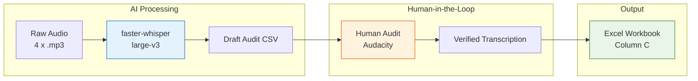

# 🎙️ AutoEIT — Test I: Audio Transcription Pipeline

**GSoC 2026 · HumanAI Foundation · Applicant: Jb Anmol**

[](https://www.python.org/)
[](https://colab.research.google.com/)
[](LICENSE)
[]
[](https://www.audacityteam.org/)

---

## 📌 Objective

Generate **research-grade transcriptions** for four non-native Spanish Elicited Imitation Task (EIT) audio files — 30 target sentences per participant, **120 utterances total** — while preserving exact learner production including mispronunciations, false starts, and hesitations.

## ⚠️ The Core Problem

Standard ASR models (including Whisper large-v3) are trained to maximize linguistic correctness. In an EIT context, this is **data falsification** — the moment Whisper silently converts a learner's `coltarme` into `cortarme`, the downstream scoring rubric measures Whisper's correction ability, not the learner's proficiency.

## 🏗️ Solution: Hybrid AI-Human Pipeline



| Stage | Tool | Purpose |
|:------|:-----|:--------|
| 1. ASR Draft | `faster-whisper` (large-v3, T4 GPU) | Generate timestamped draft transcriptions with dynamic offsets |
| 2. CSV Isolation | `02_prepare_audit_csv.py` | Map ASR segments to 30 target items; flag extras as `UNASSIGNED_N` |
| 3. Human Audit | Audacity + manual CSV editing | Correct every ASR auto-correction against the raw audio |
| 4. Write-Back | `03_populate_excel.py` | Inject verified transcriptions into master workbook (Column C) |

---

## 📊 Results

| Participant | Items | Audited | UNASSIGNED Rows | Status |
|:------------|:-----:|:-------:|:---------------:|:------:|
| 38010-2A    | 30    | 30/30   | 19              | ✅     |
| 38011-1A    | 30    | 30/30   | 8               | ✅     |
| 38012-2A    | 30    | 30/30   | 1               | ✅     |
| 38015-1A    | 30    | 30/30   | 0               | ✅     |
| **Total**   | **120** | **120/120** | —           | ✅     |

### ASR Auto-Correction Examples (Corrected During Audit)

| Learner's Actual Production | Whisper's "Correction" | Error Type |
|:---|:---|:---|
| *coltarme* | *cortarme* | Phonological substitution |
| *entla mesa* | *en la mesa* | Consonant liaison |
| *purperro* | *por el perro* | Vowel reduction |
| *keva* | *llueva* | Phonemic substitution |

---

## 📁 Repository Structure

```
├── config/
│   └── test1_metadata.yaml          # Participant IDs, filenames, offsets
├── data/
│   ├── templates/                   # Original unmodified workbooks
│   └── working/
│       └── ...WORKING.xlsx          # ✅ Final populated workbook (120 transcriptions)
├── docs/                            # Protocol documents and scoring rubrics
├── notebooks/
│   └── 01_AutoEIT_Test1_Workflow.ipynb  # ✅ Submission notebook (Colab, all outputs preserved)
├── outputs/
│   └── review_csv/
│       ├── 38010-2A_audit.csv       # ✅ Audited CSV (30 items + 19 UNASSIGNED)
│       ├── 38011-1A_audit.csv       # ✅ Audited CSV (30 items + 8 UNASSIGNED)
│       ├── 38012-2A_audit.csv       # ✅ Audited CSV (30 items + 1 UNASSIGNED)
│       └── 38015-1A_audit.csv       # ✅ Audited CSV (30 items, clean)
├── src/
│   ├── 01_run_whisper.py            # ASR batch runner (--only-id for pilot mode)
│   ├── 02_prepare_audit_csv.py      # Draft audit CSV generator
│   └── 03_populate_excel.py         # Safe Excel write-back with pre-flight validation
├── requirements-colab.txt           # Minimal Colab-safe dependencies
└── requirements.txt                 # Full locked environment (local dev)
```

---

## 🚀 Quick Start (Google Colab)

1. Upload the project zip to Colab
2. Run:
```python
!unzip autoEIT_upload.zip
%cd autoEIT-audio-transcription-jbanmol9
!pip install -r requirements-colab.txt
```
3. Follow `notebooks/01_AutoEIT_Test1_Workflow.ipynb` step-by-step

### CLI Reference

```bash
# Pilot run (single file)
python src/01_run_whisper.py --only-id 38010-2A

# Full batch (all 4 files)
python src/01_run_whisper.py

# Generate draft audit CSVs
python src/02_prepare_audit_csv.py

# Inject audited transcriptions into workbook
python src/03_populate_excel.py
```

---

## 🔒 Safety Features

- **Pre-flight validation**: Exactly 30 items, no blanks, no duplicate item numbers
- **Timestamped `.bak` backup** before every Excel modification
- **`UNASSIGNED_N` flagging**: Extra ASR segments are surfaced, never silently dropped
- **Manual audit dependency**: Write-back script refuses blank `FINAL_AUDIT_TRANSCRIPTION` cells

---

## 📝 Transcription Notation

| Tag | Meaning | Example |
|:----|:--------|:--------|
| `[word-]` | False start / self-correction | `[d-]de personas` |
| `...` | Vocalized pause / hesitation | `Me gustaría ... pronto` |
| Literal phonetic | Exact phonetic shape as heard | `purperro`, `keva`, `entla` |
| `[unintelligible]` | Truly unintelligible segment | `[unintelligible]` |
| `[no response]` | Learner did not attempt item | `[no response]` |

---

## 🔬 Key Design Decisions

1. **ASR is draft-only** — Never used as ground truth. Human audit is authoritative.
2. **No normalization** — Learner Spanish is preserved exactly as produced, per EIT protocol.
3. **Dynamic offsets** — `start_offset_sec` skips English instructions per file (150s default, 720s for 038012).
4. **Non-reproducibility is expected** — Whisper varies between runs. The pipeline is designed around this reality.

---

> ✅ **Test I Complete.** All 120 transcriptions are research-grade and ready for automated scoring in Test II.
