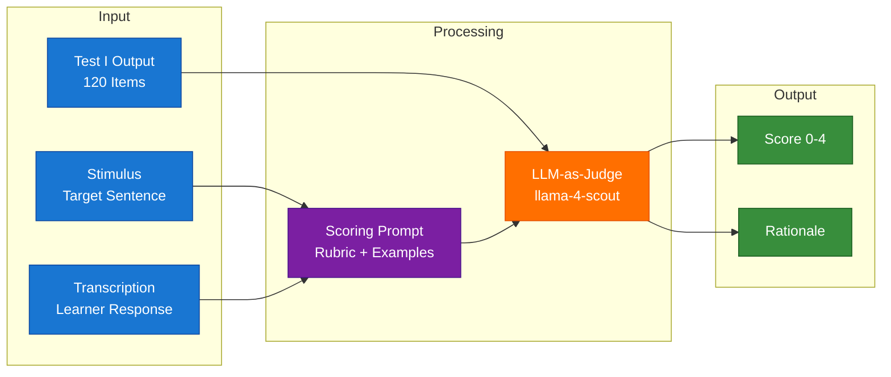
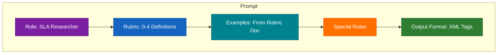

# 🎯 AutoEIT — Test II: Automated Scoring System

## 🎯 Badges

[](https://www.python.org/)
[](LICENSE)
[](https://groq.com/)


---

## 📌 Objective

Implement a reproducible automated scoring system that applies the **EIT Scoring Rubric (Ortega, 2000)** to evaluate 120 transcribed learner productions from Test I. The system compares each learner's transcription to the target stimulus and assigns a score 0-4 based on meaning preservation.

---

## 📋 Task Description

> *"Implement a reproducible script that applies the meaning-based rubric to the sentence transcriptions (comparing learner utterances to prompt sentences provided) and outputs sentence-level scores for each utterance in the sample data files."*

**Input:** Test I output with 120 transcribed utterances  
**Output:** Scores (0-4) + rationales for each item

---

## 🏗️ Architecture



### Pipeline Stages

| Stage | Script | Purpose |
|:------|:-------|:--------|
| 1. Extract | `01_extract_data.py` | Parse Excel → JSON (120 items) |
| 2. Score | `02_score_with_groq.py` | LLM judge with rubric prompt |
| 3. Validate | Consistency check | 20% sample scored twice |
| 4. Write-back | `04_populate_scores.py` | Excel with Score + Rationale |

---

## 📊 Results

### 🎓 How a Human Would Score

When a researcher scores EIT transcriptions, they ask: *"How well did the learner reproduce what they heard?"*

| Score | What It Means | Real Example |
|:-----:|:--------------|:--------------|
| **0** | "I can barely understand what they tried to say" | Only 1-2 words, or garbled |
| **1** | "They got some words but lost the meaning" | About half there, but message is gone |
| **2** | "Close but not quite right" | Most words there, but meaning is off |
| **3** | "I understood what they meant" | Minor grammar slip, but meaning clear |
| **4** | "Perfect repetition" | Exactly what they heard |

### Score Distribution

| Score | Count | Percentage | Human Interpretation |
|:-----:|:------:|:----------:|:---------------|
| 0 | 36 | 30.0% | "Couldn't make out what they said" |
| 1 | 12 | 10.0% | "Got fragments, but meaning lost" |
| 2 | 25 | 20.8% | "Almost, but meaning shifted" |
| 3 | 19 | 15.8% | "Good enough - I understood them" |
| 4 | 28 | 23.3% | "Spot on - they nailed it" |

**Mean Score: 1.93** (SD: 1.43)

### Validation Results

| Metric | Result |
|--------|--------|
| Sample Size | 24 items (20%) |
| Agreement Rate | **100%** |
| Disagreements | 0 |

---

## 🔬 Methodology

### Why LLM-as-Judge?

| Approach | Limitation | Solution |
|----------|-----------|----------|
| String matching | Cannot evaluate meaning | ✅ Understands semantic content |
| BLEU/similarity | Cannot distinguish 2 vs 3 | ✅ Follows 0-4 rubric exactly |
| Rule-based | Requires extensive coding | ✅ Learns rubric from examples |
| Fine-tuned classifier | Needs training data | ✅ Zero-shot capability |

### Model: `llama-4-scout-17b-16e-instruct`

- **Provider:** Groq (free tier, no credit card)
- **Speed:** 30K TPM, fast LPU inference
- **Quality:** Latest Llama 4 architecture

### Prompt Design



---

## 📁 Directory Structure

```
test2_scoring/
├── config/
│   └── test2_config.yaml          # Model, paths, settings
├── data/
│   └── output/
│       └── scored_results.xlsx   # ✅ Final output
├── src/
│   ├── 01_extract_data.py        # Excel → JSON
│   ├── 02_score_with_groq.py     # LLM-as-Judge
│   ├── 04_populate_scores.py     # Write to Excel
│   └── utils/
│       ├── prompt_builder.py     # Rubric prompt
│       └── score_parser.py       # Parse output
├── outputs/
│   └── scores/
│       ├── extracted_data.json   # 120 items
│       └── all_scores.json       # All scores
├── README.md
├── METHODOLOGY.md
├── SUBMISSION_CHECKLIST.md
├── requirements.txt
└── .env.example
```

---

## 🚀 Quick Start

### Prerequisites

1. **Get Groq API Key** (free): https://console.groq.com/
2. **Set Environment Variable:**
   ```bash
   export GROQ_API_KEY="your_key_here"
   ```

### Run Pipeline

```bash
cd test2_scoring
python src/01_extract_data.py      # Extract data
python src/02_score_with_groq.py   # Score all items
python src/04_populate_scores.py   # Write to Excel
```

---

## 📝 Scoring Rubric (Ortega, 2000)

| Score | Description | Examples |
|:-----:|:------------|:---------|
| **0** | Nothing/Garbled/Minimal | "Manaña", "[gibberish]" |
| **1** | ~50% preserved, meaning lost | "Dudo que sepa ma-" |
| **2** | >50% preserved, meaning inexact | "Ella sola cerveza y no come nada" |
| **3** | Meaning fully preserved | "Quiero cortar mi pelo" |
| **4** | Exact repetition | "El libro está en la mesa" |

---

## ✅ Deliverables

| File | Description |
|------|-------------|
| `scored_results.xlsx` | Excel with scores + rationales (120 items) |
| `all_scores.json` | Raw scores for audit |
| Source code | All scripts in `src/` folder |
| Documentation | README + METHODOLOGY + SUBMISSION_CHECKLIST |

---

> ✅ **Test II Complete.** All 120 items scored with transparent rationales.
